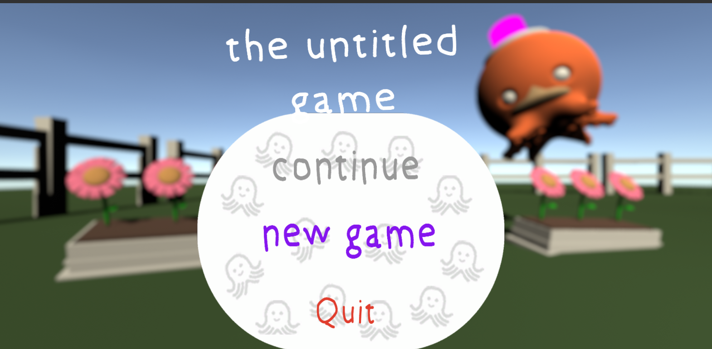
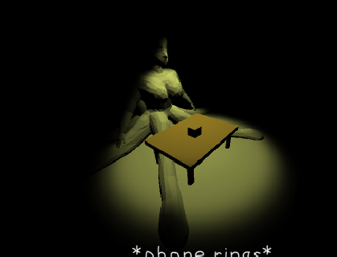
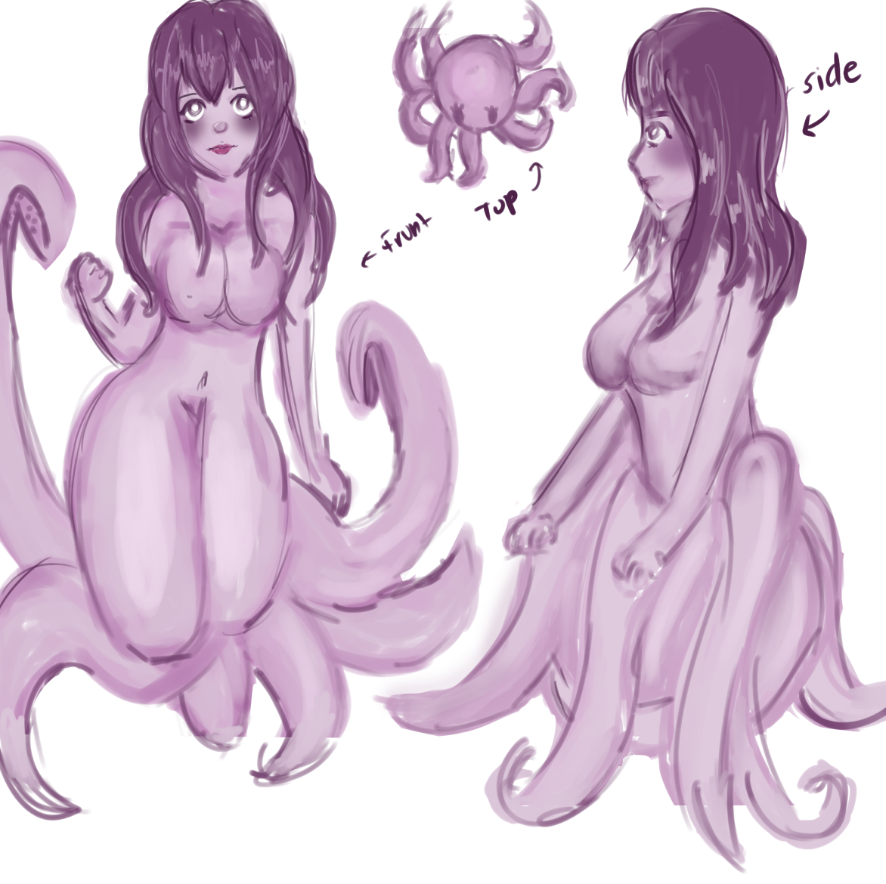

The Global Game Jam® (GGJ) is the world's largest game creation event taking place around the globe, typically at physical locations. A "game jam" is essentially a hackathon focused on game development. It is the growth of an idea that in today’s heavily connected world, we could come together, be creative, share experiences and express ourselves in a multitude of ways using video games – it is very universal. 

The Untitled Game is a game we created centered around an octopus-woman who is in charge of repairing items. She is tasked to repair items within a house. The challenging part is with several tentacles it is very difficult for the player to repair. The player is only given 4 tries before the customer tries to murder the repair women. From there the simulation game turns into a never ending maze.

I was the lead modeler and concept artist for the project. I was in charge of drawing and creating the characters for the game. I modeled the house and objects that are interactive in the game using Autodesk Maya. Along with modeling I also textured the setting and items in the game. 

Here is some snapshots of our game:

  
  
  

You can learn more at the [The Untitled Game](https://globalgamejam.org/2020/games/untitled-game-2).

