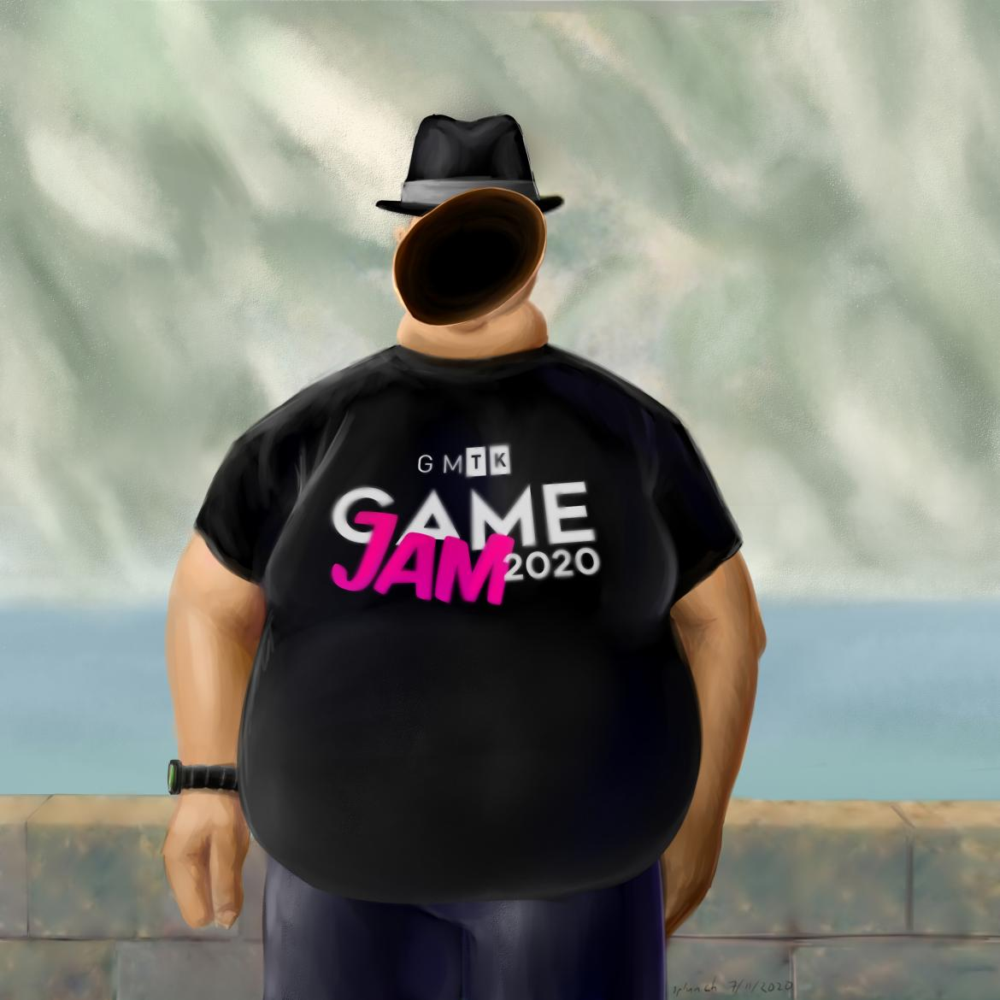
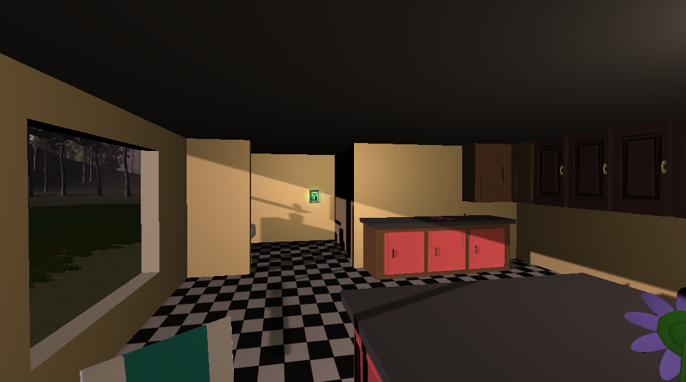
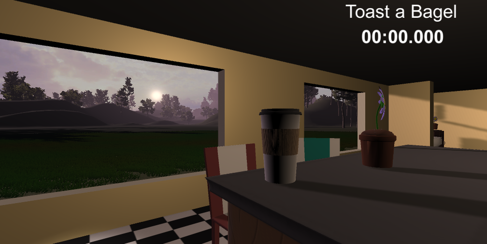
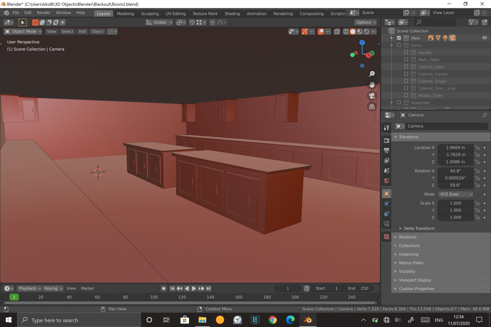
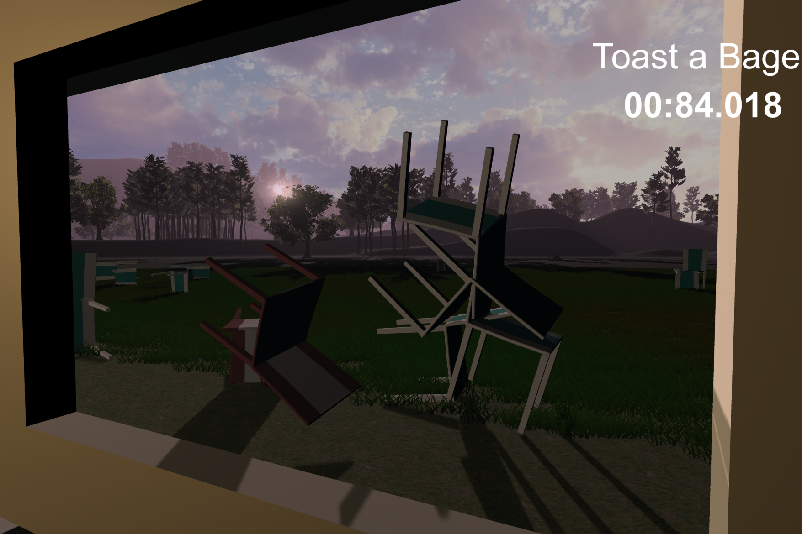

Make Bagel is a game centered around a man who is trying to toast his morning bagel. Unfortunately due to unfortunate uncontrollable circumstances the player keeps blacking out making it harder for him to do this simple task. The game is designed to be a puzzle simulation made in Unity.

I was one of the modelers on my team for this projects. I made simple items such as a simple room, tables, cabinet for the game using Autodesk Maya and Blender. The models were a tag-team effort made between me and my partner.

Here is some snapshots of our game:

  
  
  
  

You can learn more at the [Make Bagel](https://zaxer2.itch.io/make-bagel).

Source: <a href="https://github.com/spyhi/GMTK-2020-Team-Hawaii-3D"><i class="large github icon"></i>spyhi/GMTK-2020-Team-Hawaii-3D</a>
