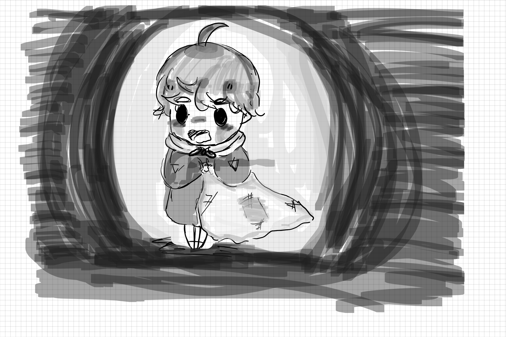

Goodnight, Logan centers around a 5 year old boy who is trapped within his nightmares and is trying to find keys and dodge monsters to return back into reality.

Goodnight, Logan is a horror 2D- based adventure game I developed using Java in my ICS 111 class. After spending more time with Unity I am working on adding more to the game as well as fixing some old code. I am the concept artist as well as the programer for the game.

Here is some concept art for the game: 

  
  
  
  

