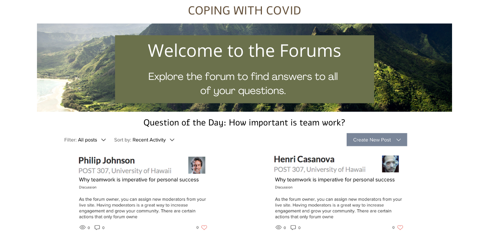

## Overview
Coping with a Covid is an application like social platform that aims to help those struggling with the pandemic. We made a chat base social platform where it is a safe space for users to post what they are feeling and to openly express themselves without fear of judgment. 

Visit the website [here](https://copingwithpandemic.xyz/#/)

## The Idea

I came up with the idea for this project are can read more about it [here] (https://chris-dang.github.io/essays/final-project-idea.html). I came up with this idea because the topic of mental health hits close to home with me. And have experience struggling during the pandemic itself.

## My Role

I worked mostly as the front end of the development as I was the one who designed the mock up and the initial theme of the application. I wanted to make something that revolved around the idea of “close to home” . All the pictures used were taken all around the island.  I also work a bit with the back end if needed. Each one of us stuck with a particular element of the project in order to finish it efficiently. Although if needed we all hopped around and helped each other when needed. For example I would have finished one of my milestones and assisted someone else if they needed. But overall most of the time I’ve been working on the whole front end implementation all the time to mitigate the problems that we might encounter.

*Mock Ups*

*Final Products* 

You can learn more at the [Coping With Covid](https://coping-with-covid.github.io/).

## Thoughts

I am really happy with the outcome that everyone worked on. With the knowledge and skills we combine together we were able to make something that impacted the community. We shared our application with others and gained feedback. Big thank you to everyone on the team “ COVID-RELIEF” for making my initial ideal come true. 
